# Monday-Snowflake Integration Documentation

## Table of Contents
1. [Overview](#overview)
2. [Architecture](#architecture)
3. [Implementation Details](#implementation-details)
4. [Data Flow](#data-flow)
5. [Scheduling](#scheduling)
6. [Error Handling](#error-handling)
7. [Prerequisites](#prerequisites)
8. [Limitations](#limitations)

---

## Overview

The Monday-Snowflake integration is a production-grade, bi-directional data synchronization system that enables real-time and scheduled data replication between Monday.com boards and Snowflake data warehouses. Built on Google Cloud Platform, it supports bulk data loads, incremental syncs, and real-time webhooks.

**Key Capabilities:**
- **Monday → Snowflake**: Board replication, subitem sync, real-time updates via webhooks
- **Snowflake → Monday**: Reverse sync for keeping Monday boards updated from Snowflake data
- **Flexible Scheduling**: Daily, weekly, and monthly sync schedules with timezone support
- **Enterprise Scale**: Handles large datasets via CSV-based bulk loads and parallel processing
- **Comprehensive Error Handling**: Automatic retries, user notifications, and queue management

---

## Architecture

### Technology Stack

```mermaid
graph TB
    subgraph External["External Systems"]
        Monday["Monday.com API<br/>• Boards/Items<br/>• Webhooks<br/>• GraphQL"]
        Snowflake["Snowflake API<br/>• Database/Schema<br/>• Tables/Stages<br/>• Warehouse"]
    end

    subgraph GCP["Google Cloud Platform"]
        CloudRun["Cloud Run<br/>(FastAPI)"]
        CloudTasks["Cloud Tasks<br/>(Queue)"]
        Firestore["Firestore<br/>(NoSQL)"]
        CloudScheduler["Cloud Scheduler"]
        CloudStorage["Cloud Storage<br/>(CSV Files)"]
        CloudLogging["Cloud Logging"]
    end

    Monday <-->|Webhooks/GraphQL| CloudRun
    Snowflake <-->|SQL Queries| CloudRun
    CloudRun --> CloudTasks
    CloudRun --> Firestore
    CloudRun --> CloudStorage
    CloudRun --> CloudLogging
    CloudScheduler -->|Triggers| CloudRun

    style GCP fill:#e8f4f8
    style External fill:#fff4e6
```



### Detailed Architecture Diagram


## Data Flow Diagrams

### Flow 1: Full Board Replication (Monday → Snowflake)

```mermaid
sequenceDiagram
    participant User
    participant Scheduler as Cloud Scheduler
    participant Router as FastAPI Router<br/>(triggers.py)
    participant Queue as Cloud Tasks
    participant Worker as Task Worker<br/>(replicate_board)
    participant Monday as Monday API
    participant GCS as Cloud Storage
    participant SF as Snowflake
    participant FS as Firestore

    User->>Scheduler: Trigger sync or schedule reached
    Scheduler->>Router: POST /triggers/scheduled/{integration_id}
    Router->>Router: Validate & authenticate
    Router->>Queue: Enqueue task (30min deadline)
    Queue->>Worker: Execute task

    Worker->>Worker: ① Acquire distributed lock
    Worker->>FS: ② Fetch integration config
    Worker->>FS: ③ Get OAuth tokens

    loop Paginate items (500/page)
        Worker->>Monday: ④ Query GraphQL API
        Monday-->>Worker: Items batch
        Worker->>Worker: ⑤ Transform data
    end

    Worker->>GCS: ⑥ Write CSV file (<100MB)
    Worker->>SF: ⑦ CREATE TABLE IF NOT EXISTS
    Worker->>SF: ⑦ CREATE STAGE IF NOT EXISTS
    Worker->>SF: ⑦ COPY INTO table FROM stage
    Worker->>SF: ⑦ MERGE INTO table (upsert)
    SF-->>Worker: ⑧ Execution complete

    Worker->>FS: ⑨ Update IntegrationHistory
    Worker->>Worker: ⑩ Release lock
    Worker-->>Queue: Task complete
```



### Flow 2: Real-Time Sync (Monday → Snowflake)

```mermaid
sequenceDiagram
    participant Board as Monday Board
    participant Webhook as Monday Webhook
    participant Router as FastAPI Router
    participant Queue as Cloud Tasks
    participant Worker as Task Worker<br/>(run_real_time_trigger)
    participant Monday as Monday API
    participant SF as Snowflake
    participant FS as Firestore

    Board->>Webhook: User creates/updates item
    Webhook->>Router: POST /triggers/real-time<br/>Event: create_pulse, change_column_value
    Router->>Router: Validate HMAC signature
    Router->>Queue: Enqueue task<br/>Queue: monday-snowflake-events-{account_id}

    Queue->>Worker: Execute task
    Worker->>FS: ① Find integration for board_id
    Worker->>Monday: ② Fetch single item
    Monday-->>Worker: Item data

    Worker->>Worker: ③ Map columns to Snowflake fields
    Worker->>Worker: ④ Transform values

    Worker->>SF: ⑤⑥ MERGE INTO table<br/>WHEN MATCHED THEN UPDATE<br/>WHEN NOT MATCHED THEN INSERT
    SF-->>Worker: Upsert complete (<1 sec)

    alt display_errors enabled
        Worker->>Monday: ⑦ Update long-text column with result
    end

    Worker->>FS: ⑧ Log to IntegrationHistory
```



### Flow 3: Reverse Sync (Snowflake → Monday)

```mermaid
sequenceDiagram
    participant Scheduler as Cloud Scheduler
    participant Worker as Task Worker<br/>(run_sync_sf_to_monday_trigger)
    participant FS as Firestore
    participant SF as Snowflake
    participant Monday as Monday API
    participant Board as Monday Board

    Scheduler->>Worker: Trigger at scheduled time
    Worker->>FS: ① Fetch integration config
    Worker->>FS: ② Get Snowflake OAuth token

    Worker->>SF: ③ SELECT * FROM table WHERE filter
    SF-->>Worker: Query results

    Worker->>Monday: ④ Fetch board schema
    Monday-->>Worker: Column definitions

    Worker->>Worker: ⑤ Map Snowflake columns → Monday column IDs

    loop For each row
        Worker->>Worker: ⑥ Transform Snowflake types → Monday types
        Worker->>Worker: Check if item exists (by primary key)

        alt Item exists
            Worker->>Monday: Update item via GraphQL
        else Item does not exist
            Worker->>Monday: Create new item via GraphQL
        end

        Worker->>Worker: ⑦ Handle rate limits
    end

    Monday-->>Board: Items created/updated
    Worker->>FS: ⑧ Update IntegrationHistory
```



### Flow 4: Error Handling

```mermaid
flowchart TB
    Start([Task Execution]) --> Error[Error Occurs]

    Error --> Decision{Error Type?}

    Decision -->|Transient| Transient[Transient Error<br/>• Network timeout<br/>• Rate limit<br/>• Lock conflict]
    Decision -->|Permanent| Permanent[Permanent Error<br/>• Auth expired<br/>• Permission denied<br/>• Invalid data]

    Transient --> Retry[Auto Retry<br/>• Exponential backoff<br/>• Max 3 retries<br/>• Cloud Tasks handles]

    Retry --> RetryResult{Success?}
    RetryResult -->|Yes| Success([Success])
    RetryResult -->|No| FinalFailure([Final Failure])

    Permanent --> Actions[Pause Queue<br/>• Create Alert<br/>• Send Email<br/>• Log to Firestore<br/>• Display in UI]

    Actions --> UserAction[User Action Required<br/>• Re-authenticate<br/>• Fix permissions<br/>• Update config]

    style Start fill:#e8f5e9
    style Success fill:#c8e6c9
    style FinalFailure fill:#ffcdd2
    style UserAction fill:#fff9c4
    style Transient fill:#b3e5fc
    style Permanent fill:#ffccbc
```



### Component Interaction Diagram


### Core Components

#### 1. **FastAPI Application** ([main.py](../main.py), [application.py](../app/application.py))
- Async web framework serving REST endpoints
- Dependency injection via `containers.py`
- Multiple routers for different concerns (actions, triggers, events, etc.)

#### 2. **Dependency Injection Container** ([containers.py](../app/containers.py))
Wires up all services:
- Firestore database client
- Cloud Tasks queue client
- Cloud Scheduler client
- Cloud Storage client
- Email service (Gmail)
- Logging service

#### 3. **API Routers**
- **[actions.py](../app/routers/actions.py)**: Monday automation action triggers
- **[triggers.py](../app/routers/triggers.py)**: Webhook handlers and scheduled triggers
- **[data_loads.py](../app/routers/data_loads.py)**: Bulk CSV-based data loading
- **[events.py](../app/routers/events.py)**: App lifecycle events (install/uninstall)
- **[preload.py](../app/routers/preload.py)**: Metadata caching (boards, schemas)
- **[integrations.py](../app/routers/integrations.py)**: Batch integration operations
- **[settings.py](../app/routers/settings.py)**: Recipe/feature configuration
- **[admin.py](../app/routers/admin.py)**: Debugging endpoints

#### 4. **Business Logic** ([functions.py](../app/functions.py))
2,588 lines of core integration operations:
- `replicate_board()`: Full/incremental board sync
- `replicate_subitems()`: Subitem table replication
- `upsert_row()`: Single row upsert to Snowflake
- `delete_rows()`: Row deletion based on Monday events
- `run_real_time_trigger()`: Webhook event processing
- `run_sync_snowflake_to_monday_trigger()`: Reverse sync

#### 5. **Data Models**
Imported from shared `common` package:
- Monday API models (boards, items, columns, webhooks)
- Firestore models (accounts, users, connections, installations)
- Integration models (MondayIntegration, IntegrationHistory)

---

## Implementation Details

### Language and Framework
- **Python 3.12** with async/await patterns
- **FastAPI** for REST API
- **Firedantic** ORM for Firestore
- **Pydantic** for data validation

### Data Persistence
All configuration and state stored in Firestore:

```
Firestore Collections:
├── accounts (Monday account data)
├── users (User authentication tokens)
├── connections (OAuth credentials for Monday/Snowflake)
├── installations (App installation records)
├── monday_integrations (Integration recipes/configs)
│   └── integration_history (subcollection: sync run logs)
├── features (Available integration recipes)
└── subscriptions (Billing information)
```

### Column Type Mappings ([constants.py](../app/constants.py))

The integration automatically maps Monday column types to Snowflake data types:

| Monday Column Type | Snowflake Type | Notes |
|-------------------|----------------|-------|
| text, long_text | VARCHAR | General text |
| numbers, numeric | NUMBER | Integers and decimals |
| status, dropdown | VARCHAR | Enum-like values |
| date | DATE | Date values |
| creation_log, last_updated | TIMESTAMP_NTZ | Timestamps |
| checkbox | BOOLEAN | True/False |
| email, phone, link | VARCHAR | Formatted strings |
| people, board_relation, dependency | VARIANT | JSON arrays |
| location, tags | VARIANT | Complex objects |
| mirror | VARIANT | Mirrored column data |

### Authentication

#### Monday OAuth Flow
1. User authorizes app in Monday workspace
2. OAuth callback receives authorization code
3. Exchange code for access token
4. Store token in Firestore `connections` collection

#### Snowflake Authentication
- Uses **programmatic access tokens** (PAT)
- Tokens stored in Firestore, encrypted at rest
- Token expiry detection triggers user alerts

---

## Data Flow

### 1. Monday → Snowflake (Primary Direction)

#### A. Full Board Replication
```
User Triggers Sync
       ↓
Cloud Scheduler invokes webhook
       ↓
Cloud Task enqueued
       ↓
replicate_board() function
       ↓
Fetch Monday items (paginated, 500/page)
       ↓
Write to CSV in Cloud Storage
       ↓
Generate Snowflake COPY INTO command
       ↓
MERGE data (upsert based on primary key)
       ↓
Update IntegrationHistory in Firestore
```

**Key Features:**
- Incremental sync using `last_successful_run_at` timestamp
- Parallel processing for large boards
- Automatic retry on transient failures
- Progress tracking via sharded counters

#### B. Real-Time Sync (Webhooks)
```
Monday Board Change Event
       ↓
Webhook POST to /triggers/real-time
       ↓
Validate signature (monday_snowflake_signing_secret)
       ↓
Enqueue Cloud Task
       ↓
run_real_time_trigger() processes event
       ↓
upsert_row() to Snowflake
       ↓
Update item in Monday (optional display_errors)
```

**Webhook Events:**
- `create_pulse`: New item created
- `change_column_value`: Column updated
- `delete_pulse`: Item deleted
- `create_subitem`: Subitem created

#### C. Subitem Replication
- Separate tables created for subitems
- Table naming: `{parent_board_name}_subitems`
- Includes parent item reference via primary key
- Supports all same column types as parent items

### 2. Snowflake → Monday (Reverse Direction)

```
Scheduled Trigger
       ↓
run_sync_snowflake_to_monday_trigger()
       ↓
Execute SELECT query on Snowflake table
       ↓
Map columns using primary key relationships
       ↓
Create/Update items in Monday board
       ↓
Log results in IntegrationHistory
```

**Capabilities:**
- Create new items from Snowflake rows
- Update existing items based on primary key match
- Supports subset of Monday column types
- Handles column type conversions automatically

### 3. Data Transformation ([utils.py](../app/utils.py))

#### Monday → Snowflake Formatting
- **Dates**: Convert ISO 8601 to Snowflake DATE format
- **Timestamps**: Preserve timezone or convert to NTZ
- **People**: Extract user IDs, names as JSON arrays
- **Board Relations**: Store linked item IDs as VARIANT
- **Status/Dropdown**: Extract label text
- **Numbers**: Handle null, infinity, and precision

#### Snowflake → Monday Formatting
- **Text**: Truncate long values if needed
- **Numbers**: Format as Monday numeric columns
- **Dates**: Convert to Monday date format (YYYY-MM-DD)
- **JSON/VARIANT**: Parse and validate before inserting
- **Boolean**: Convert to Monday checkbox values

---

## Scheduling

### Scheduler Types
Defined in `SchedulerType` enum:
- **DAILY**: Runs at specified time each day
- **WEEKLY**: Runs on specific days of week
- **MONTHLY**: Runs on specific dates of month

### Configuration
Stored in `MondayIntegration.input_fields.scheduler_config`:
```python
{
    "schedule_type": "WEEKLY",
    "hour": 14,  # 2 PM
    "minute": 0,
    "timezone": "America/New_York",
    "days_of_week": [1, 3, 5],  # Monday, Wednesday, Friday
    "days_of_month": None  # Only for MONTHLY
}
```

### Implementation Flow
```
User configures schedule in Monday UI
       ↓
POST /settings/{integration_id}
       ↓
Create Cloud Scheduler job
  - Name: monday-snowflake-{integration_id}
  - Schedule: Cron expression generated
  - Target: /triggers/scheduled/{integration_id}
       ↓
Scheduler invokes webhook at specified times
       ↓
Enqueue Cloud Task (deadline: 30 minutes)
       ↓
Process sync operation
```

### Timezone Handling
- Supports all pytz timezones
- `get_seconds_from_now()` calculates next run time
- Handles DST transitions automatically
- Schedule displayed in user's local timezone

### Task Queue Management
- **Queue Naming**: `monday-snowflake-events-{account_id}`
- **Max Concurrent**: 50 tasks per queue
- **Task Deadline**: 30 minutes (1800 seconds)
- **Auto-Pause**: Queue paused on connection errors

---

## Error Handling

### Multi-Level Error Strategy

#### 1. Authentication Errors

**Detection:**
```python
if "Programmatic access token is expired" in error_message:
    # Token expired
```

**Response:**
- Create `IntegrationAlert` in Firestore
- Pause Cloud Tasks queue for account
- Send email notification to user
- Mark connection as disconnected
- Display alert in Monday UI

#### 2. API Rate Limiting

**Monday API:**
- Tracks `complexity` in GraphQL responses
- Calculates remaining quota
- Auto-sleeps when exhausted:
  ```python
  await asyncio.sleep(complexity.reset_in_x_seconds + 1)
  ```
- Cursor-based pagination handles expiry

**Snowflake API:**
- Respects query timeout limits
- Implements connection pooling
- Retries on transient network errors

#### 3. Data Validation

**Pre-Insert Validation:**
- Column type checking before SQL execution
- JSON validation for VARIANT columns
- SQL injection prevention via parameterized queries
- Safe escaping with `format_sf()` function

**Custom Exceptions:**
- `SnowflakeIntegrationException`: Business logic errors
- Includes error context (integration_id, board_id, item_id)
- Logged to Cloud Logging with structured fields

#### 4. Concurrency Control

**Distributed Locking:**
```python
lock = await acquire_lock_for_owner(
    owner=f"integration_{integration_id}",
    timeout=1800  # 30 minutes
)
if not lock:
    return JSONResponse(status_code=409, content="Already running")
```

**Prevents:**
- Duplicate processing of same integration
- Race conditions on shared resources
- Queue backlog from stuck tasks

#### 5. Integration Run Tracking

**IntegrationHistory Model:**
```python
{
    "id": "run_123",
    "status": "RUNNING | COMPLETED | FAILED",
    "started_at": timestamp,
    "completed_at": timestamp,
    "error_message": "Optional error details",
    "subtasks": [
        {"name": "replicate_board", "status": "COMPLETED"},
        {"name": "replicate_subitems", "status": "FAILED"}
    ],
    "rows_processed": 1000,
    "rows_failed": 5
}
```

**Benefits:**
- Audit trail for all sync operations
- Debugging failed runs
- Performance metrics (duration, throughput)
- User-visible run history in Monday

#### 6. User-Facing Errors

**Optional Error Display:**
```python
if integration.input_fields.get("display_errors"):
    await update_long_text_column_with_error(
        board_id=board_id,
        item_id=item_id,
        column_id=error_column_id,
        error_message=str(error)
    )
```

**Displayed Errors:**
- Validation failures (invalid data types)
- Permission errors (Snowflake access denied)
- Network timeouts
- Column mapping issues

#### 7. Logging and Monitoring

**Cloud Logging Integration:**
- Structured logs with JSON payloads
- Log levels: DEBUG, INFO, WARNING, ERROR, CRITICAL
- Correlation IDs for request tracing
- Performance metrics (latency, throughput)

**Monitored Metrics:**
- Task queue depth
- Failed task rate
- API error rates (Monday/Snowflake)
- Integration run duration
- Data throughput (rows/second)

---

## Prerequisites

### 1. Google Cloud Platform

**Required Services:**
- **Cloud Run**: Deploy FastAPI application
- **Cloud Tasks**: Asynchronous job processing
- **Cloud Scheduler**: Scheduled trigger execution
- **Firestore**: Configuration and state storage
- **Cloud Storage**: CSV file storage for bulk loads
- **Cloud Logging**: Application logs and monitoring

**IAM Permissions:**
Service account needs:
- `cloudtasks.tasks.create`
- `cloudtasks.queues.get`
- `cloudtasks.queues.update`
- `cloudscheduler.jobs.create`
- `cloudscheduler.jobs.delete`
- `cloudscheduler.jobs.update`
- `datastore.entities.get`
- `datastore.entities.create`
- `datastore.entities.update`
- `storage.objects.create`
- `storage.objects.get`
- `logging.logEntries.create`

**Environment Variables:**
```yaml
project: your-gcp-project-id
location: us-central1
base_url: https://your-service.run.app
service_account: service-account@project.iam.gserviceaccount.com
snowflake_data_loads_bucket: your-bucket-name
use_cloud_logging: true
log_level: INFO
```

### 2. Monday.com

**App Installation:**
1. Create Monday app in developer portal
2. Configure OAuth scopes:
   - `boards:read` - Read board data
   - `boards:write` - Update items
   - `webhooks:write` - Create webhook subscriptions
3. Set OAuth redirect URL: `{base_url}/oauth/callback`
4. Note `client_id` and `client_secret`

**Webhook Configuration:**
- Signing secret stored in `monday_snowflake_signing_secret`
- Webhook URL: `{base_url}/triggers/real-time`
- Supported events: create_pulse, change_column_value, delete_pulse

**Board Requirements:**
- User must have board permissions (viewer, editor, or owner)
- Board must not be archived
- Columns must have stable IDs (don't change column IDs after setup)

### 3. Snowflake

**Authentication:**
- **Programmatic Access Token (PAT)** required
- Generate in Snowflake UI: Account → Security → Programmatic Access
- Token must have ACCOUNTADMIN or sufficient privileges

**Permissions Required:**
- `CREATE DATABASE` or access to existing database
- `CREATE SCHEMA` or access to existing schema
- `CREATE TABLE` in target schema
- `INSERT`, `UPDATE`, `DELETE` on tables
- `CREATE STAGE` for CSV loading
- `USAGE` on warehouse

**Warehouse Configuration:**
- Auto-suspend recommended (e.g., 5 minutes)
- Size based on data volume (X-Small for < 1M rows)
- Multi-cluster not required for most use cases

**Network Access:**
- Allow inbound connections from Cloud Run IP ranges
- Or use Snowflake network policy allowlist

### 4. Firestore

**Database Setup:**
1. Create Firestore database in Google Cloud Console
2. Select **Native Mode** (not Datastore mode)
3. Choose multi-region location for high availability

**Collections to Initialize:**
- `accounts`: Monday account metadata
- `users`: User authentication records
- `connections`: OAuth tokens (Monday, Snowflake)
- `installations`: App installation records
- `monday_integrations`: Integration configurations
- `features`: Available integration recipes
- `subscriptions`: Billing and usage tracking

**Indexes:**
Most queries use equality filters, but consider indexes for:
- `monday_integrations`: `account_id`, `status`
- `integration_history`: `integration_id`, `started_at`
- `connections`: `account_id`, `service_name`

### 5. Email Notifications (Optional)

**Gmail Setup:**
```yaml
gmail_app_password: your-app-password
gmail_sender: notifications@yourcompany.com
```

**App Password Generation:**
1. Enable 2-Step Verification on Gmail account
2. Generate App Password in Security settings
3. Store in environment variable

---

## Limitations

### 1. Monday.com Limitations

**API Rate Limits:**
- **Complexity-based**: 10M complexity points per minute
- **Query Complexity**: Varies by query (typically 100-1000 per request)
- **Items per Query**: Max 500 items per page
- **Mutations**: ~50 per second recommended

**Column Type Restrictions:**
- **Not Supported**:
  - Formula columns (computed values)
  - Timeline columns (complex date ranges)
  - Week columns (week-based dates)
  - Time tracking columns (duration tracking)
  - File columns (binary data, use links instead)
  - Button columns (action triggers)
- **Partially Supported**:
  - Mirror columns (readonly, synced as VARIANT)
  - Board relation columns (IDs only, not full items)

**Board Constraints:**
- Max 500,000 items per board (Monday limit)
- Max 200 columns per board (Monday limit)
- Private boards require explicit user permission

### 2. Snowflake Limitations

**Query Constraints:**
- Default query timeout: 30 minutes
- Max CSV file size: 5 GB (split large boards)
- Max VARIANT size: 16 MB per value
- Max VARCHAR length: 16 MB

**Data Type Precision:**
- NUMBER: 38 digits precision
- Dates before 1582-10-15 not supported (Gregorian calendar)
- TIMESTAMP range: 0001-01-01 to 9999-12-31

**Concurrency:**
- Max 64 concurrent queries per warehouse (default)
- Queuing occurs if warehouse saturated
- Consider larger warehouse for parallel loads

### 3. Integration Limitations

**Sync Performance:**
- **Full Board Sync**: ~1000 items/second (via CSV)
- **Real-Time Sync**: ~50 items/second (individual upserts)
- **Subitem Sync**: Additional 30% overhead
- **Reverse Sync (SF → Monday)**: ~20 items/second (API limited)

**Scheduling Constraints:**
- Minimum schedule interval: 1 hour (Cloud Scheduler limitation)
- Max concurrent syncs per account: 10 (configurable)
- Task deadline: 30 minutes (extended runs may timeout)

**Data Size Limits:**
- **CSV Load**: Max 100 MB per file (split recommended)
- **Firestore Document**: Max 1 MB (affects large integration configs)
- **Cloud Task Payload**: Max 1 MB (large webhooks may fail)

**Column Mapping:**
- Primary key must be stable (don't change after setup)
- Column renames require manual remapping
- Deleted columns leave orphaned Snowflake columns
- New columns not auto-added (requires re-sync setup)

### 4. Cost Considerations

**Google Cloud:**
- Cloud Run: Pay per request + CPU/memory time
- Cloud Tasks: $0.40 per million tasks
- Firestore: $0.06 per 100K reads, $0.18 per 100K writes
- Cloud Storage: $0.020 per GB/month

**Snowflake:**
- Warehouse compute: Billed per second
- Storage: $40 per TB/month (compressed)
- Data transfer: Egress charges for reverse sync

**Monday:**
- API calls included in subscription
- May require Enterprise plan for high-volume usage

### 5. Error Recovery

**Manual Intervention Required:**
- Expired Snowflake tokens (user must re-authenticate)
- Deleted Monday boards (remove integration manually)
- Schema changes (may require re-setup)
- Corrupted Firestore data (restore from backup)

**Automatic Retries:**
- Transient network errors: 3 retries with exponential backoff
- Rate limit errors: Automatic sleep + retry
- Lock contention: Task retried by Cloud Tasks

**No Automatic Handling:**
- Data type mismatches (e.g., inserting text into NUMBER column)
- Permission errors (user must grant access)
- Invalid column mappings (user must reconfigure)

### 6. Security Considerations

**Data at Rest:**
- Firestore: Encrypted by Google (AES-256)
- Cloud Storage: Encrypted by Google
- Snowflake: Encrypted per Snowflake settings

**Data in Transit:**
- All API calls over HTTPS (TLS 1.2+)
- OAuth tokens not logged
- Webhook signatures validated

**Access Control:**
- Service account uses least privilege IAM roles
- User OAuth tokens scoped to required permissions
- No cross-account data access

**Compliance:**
- GDPR: User data deletable via uninstall
- SOC 2: GCP and Snowflake certified
- HIPAA: Not supported (PHI should not be synced)

---

## Next Steps

1. **Review Configuration**: Check [etc/config.yaml](../etc/config.yaml) for environment setup
2. **Explore Code**: Start with [functions.py](../app/functions.py) for business logic
3. **Test Locally**: Use `docker-compose up` to run locally
4. **Deploy**: Follow deployment guide in [README.md](../README.md)
5. **Monitor**: Set up Cloud Monitoring dashboards for key metrics

For questions or issues, refer to inline code documentation or contact the development team.
