# Monday-Snowflake Integration Documentation

> **Documentation Notice**: This document provides architectural and technical overview of the Monday-Snowflake integration. It is intended for evaluation, understanding system design, and implementation planning. Specific implementation details, endpoint paths, and configuration specifics are subject to change and should not be considered part of any public API contract.

## Table of Contents
1. [Overview](#overview)
2. [Architecture](#architecture)
3. [Implementation Details](#implementation-details)
4. [Data Flow](#data-flow)
5. [Scheduling](#scheduling)
6. [Error Handling](#error-handling)
7. [Prerequisites](#prerequisites)
8. [Limitations](#limitations)
9. [Support](#support)

---

## Overview

The Monday-Snowflake integration is a production-grade, bi-directional data synchronization system that enables real-time and scheduled data replication between Monday.com boards and Snowflake data warehouses. Built on Google Cloud Platform, it supports bulk data loads, incremental syncs, and real-time webhooks.

**Key Capabilities:**
- **Monday → Snowflake**: Board replication, subitem sync, real-time updates via webhooks
- **Snowflake → Monday**: Reverse sync for keeping Monday boards updated from Snowflake data
- **Flexible Scheduling**: Hourly, daily, weekly, and monthly sync schedules with timezone support
- **Enterprise Scale**: Handles large datasets via CSV-based bulk loads and parallel processing
- **Comprehensive Error Handling**: Automatic retries, user notifications, and queue management

---

## Architecture

### Technology Stack

```mermaid
graph TB
    subgraph External["External Systems"]
        Monday["Monday.com API<br/>• Boards/Items<br/>• Webhooks<br/>• GraphQL"]
        Snowflake["Snowflake API<br/>• Database/Schema<br/>• Tables/Stages<br/>• Warehouse"]
    end

    subgraph GCP["Google Cloud Platform"]
        CloudRun["Cloud Run<br/>(FastAPI)"]
        CloudTasks["Cloud Tasks<br/>(Queue)"]
        Firestore["Firestore<br/>(NoSQL)"]
        CloudScheduler["Cloud Scheduler"]
        CloudStorage["Cloud Storage<br/>(CSV Files)"]
        CloudLogging["Cloud Logging"]
    end

    Monday <-->|Webhooks/GraphQL| CloudRun
    Snowflake <-->|SQL Queries| CloudRun
    CloudRun --> CloudTasks
    CloudRun --> Firestore
    CloudRun --> CloudStorage
    CloudRun --> CloudLogging
    CloudScheduler -->|Triggers| CloudRun

    style GCP fill:#e8f4f8
    style External fill:#fff4e6
```



### Detailed Architecture Diagram

```mermaid
graph TB
    subgraph External["🌐 External Systems"]
        Monday["Monday.com<br/>• Boards/Items<br/>• Webhooks<br/>• GraphQL API<br/>• OAuth Provider"]
        Snowflake["Snowflake<br/>• Database/Schema<br/>• Tables/Stages<br/>• Warehouse<br/>• PAT Auth"]
    end

    subgraph GCP["☁️ Google Cloud Platform"]
        subgraph CloudRun["Cloud Run (FastAPI)"]
            subgraph Routers["API Routers"]
                RT["Real-time triggers<br/>Monday webhooks"]
                RS["Scheduled triggers<br/>Cloud Scheduler"]
                AR["Action handlers<br/>Monday automations"]
                DL["Data loading<br/>Bulk CSV loading"]
                EV["Event handlers<br/>Install/uninstall"]
                ST["Settings management<br/>Recipe configuration"]
                IB["Batch operations<br/>Multiple integrations"]
            end

            subgraph Logic["Business Logic"]
                RB["Board Replication"]
                RSB["Subitem Sync"]
                UR["Row Upsert"]
                DR["Row Deletion"]
                RTT["Real-time Triggers"]
                RST["Reverse Sync"]
                GMI["Data Retrieval"]
                ESQ["Query Execution"]
            end

            Routers --> Logic
        end

        FS["Firestore<br/>• accounts<br/>• users<br/>• connections<br/>• monday_integrations<br/>  └─ history<br/>• features"]
        CT["Cloud Tasks<br/>Per-account queues<br/>Max: 50 concurrent"]
        CS["Cloud Scheduler<br/>Cron Jobs per Integration<br/>Min: 1hr interval"]
        GCS["Cloud Storage<br/>CSV Files for Bulk Loading<br/>Format: board_{id}.csv<br/>Size: <100MB"]

        subgraph DI["Service Layer"]
            Services["Database • Task Queue • Scheduler<br/>Storage • Email • Logging"]
        end

        Logic --> FS
        Logic --> CT
        Logic --> CS
        Logic --> GCS
        DI -.provides.-> Logic
    end

    Monday <-->|①② Webhooks/GraphQL| Routers
    Snowflake <-->|④⑤ SQL/COPY INTO| Logic

    style External fill:#fff4e6
    style GCP fill:#e8f4f8
    style CloudRun fill:#d4e9f7
    style Routers fill:#f0f8ff
    style Logic fill:#e6f3ff
```



## Data Flow Diagrams

### Flow 1: Full Board Replication (Monday → Snowflake)

```mermaid
sequenceDiagram
    participant User
    participant Scheduler as Cloud Scheduler
    participant Router as API Router
    participant Queue as Cloud Tasks
    participant Worker as Task Worker
    participant Monday as Monday API
    participant GCS as Cloud Storage
    participant SF as Snowflake
    participant FS as Firestore

    User->>Scheduler: Trigger sync or schedule reached
    Scheduler->>Router: POST to scheduled trigger endpoint
    Router->>Router: Validate & authenticate
    Router->>Queue: Enqueue task (30min deadline)
    Queue->>Worker: Execute task

    Worker->>Worker: ① Acquire distributed lock
    Worker->>FS: ② Fetch integration config
    Worker->>FS: ③ Get OAuth tokens

    loop Paginate items (500/page)
        Worker->>Monday: ④ Query GraphQL API
        Monday-->>Worker: Items batch
        Worker->>Worker: ⑤ Transform data
    end

    Worker->>GCS: ⑥ Write CSV file (<100MB)
    Worker->>SF: ⑦ CREATE TABLE IF NOT EXISTS
    Worker->>SF: ⑦ CREATE STAGE IF NOT EXISTS
    Worker->>SF: ⑦ COPY INTO table FROM stage
    Worker->>SF: ⑦ MERGE INTO table (upsert)
    SF-->>Worker: ⑧ Execution complete

    Worker->>FS: ⑨ Update IntegrationHistory
    Worker->>Worker: ⑩ Release lock
    Worker-->>Queue: Task complete
```



### Flow 2: Real-Time Sync (Monday → Snowflake)

```mermaid
sequenceDiagram
    participant Board as Monday Board
    participant Webhook as Monday Webhook
    participant Router as API Router
    participant Queue as Cloud Tasks
    participant Worker as Task Worker
    participant Monday as Monday API
    participant SF as Snowflake
    participant FS as Firestore

    Board->>Webhook: User creates/updates item
    Webhook->>Router: POST to webhook endpoint<br/>Event: create_pulse, change_column_value
    Router->>Router: Validate HMAC signature
    Router->>Queue: Enqueue task to account-specific queue

    Queue->>Worker: Execute task
    Worker->>FS: ① Find integration for board_id
    Worker->>Monday: ② Fetch single item
    Monday-->>Worker: Item data

    Worker->>Worker: ③ Map columns to Snowflake fields
    Worker->>Worker: ④ Transform values

    Worker->>SF: ⑤⑥ MERGE INTO table<br/>WHEN MATCHED THEN UPDATE<br/>WHEN NOT MATCHED THEN INSERT
    SF-->>Worker: Upsert complete (<1 sec)

    alt display_errors enabled
        Worker->>Monday: ⑦ Update long-text column with result
    end

    Worker->>FS: ⑧ Log to IntegrationHistory
```



### Flow 3: Reverse Sync (Snowflake → Monday)

```mermaid
sequenceDiagram
    participant Scheduler as Cloud Scheduler
    participant Worker as Task Worker
    participant FS as Firestore
    participant SF as Snowflake
    participant Monday as Monday API
    participant Board as Monday Board

    Scheduler->>Worker: Trigger at scheduled time
    Worker->>FS: ① Fetch integration config
    Worker->>FS: ② Get Snowflake OAuth token

    Worker->>SF: ③ SELECT * FROM table WHERE filter
    SF-->>Worker: Query results

    Worker->>Monday: ④ Fetch board schema
    Monday-->>Worker: Column definitions

    Worker->>Worker: ⑤ Map Snowflake columns → Monday column IDs

    loop For each row
        Worker->>Worker: ⑥ Transform Snowflake types → Monday types
        Worker->>Worker: Check if item exists (by primary key)

        alt Item exists
            Worker->>Monday: Update item via GraphQL
        else Item does not exist
            Worker->>Monday: Create new item via GraphQL
        end

        Worker->>Worker: ⑦ Handle rate limits
    end

    Monday-->>Board: Items created/updated
    Worker->>FS: ⑧ Update IntegrationHistory
```



### Flow 4: Error Handling

```mermaid
flowchart TB
    Start([Task Execution]) --> Error[Error Occurs]

    Error --> Decision{Error Type?}

    Decision -->|Transient| Transient[Transient Error<br/>• Network timeout<br/>• Rate limit<br/>• Lock conflict]
    Decision -->|Permanent| Permanent[Permanent Error<br/>• Auth expired<br/>• Permission denied<br/>• Invalid data]

    Transient --> Retry[Auto Retry<br/>• Exponential backoff<br/>• Max 3 retries<br/>• Cloud Tasks handles]

    Retry --> RetryResult{Success?}
    RetryResult -->|Yes| Success([Success])
    RetryResult -->|No| FinalFailure([Final Failure])

    Permanent --> Actions[Pause Queue<br/>• Create Alert<br/>• Send Email<br/>• Log to Firestore<br/>• Display in UI]

    Actions --> UserAction[User Action Required<br/>• Re-authenticate<br/>• Fix permissions<br/>• Update config]

    style Start fill:#e8f5e9
    style Success fill:#c8e6c9
    style FinalFailure fill:#ffcdd2
    style UserAction fill:#fff9c4
    style Transient fill:#b3e5fc
    style Permanent fill:#ffccbc
```



### Core Components

#### 1. **API Layer**
- REST API serving integration endpoints
- Handles webhook events, scheduled triggers, and user actions
- Asynchronous request processing for high throughput
- Multiple specialized endpoints for different operations

#### 2. **Service Layer**
Coordinates core platform services:
- Database operations and state management
- Task queue orchestration
- Scheduled job management
- File storage operations
- Email notifications
- Structured logging and monitoring

#### 3. **Integration Operations**
- **Action Handlers**: Process Monday automation triggers
- **Webhook Handlers**: Real-time event processing from Monday
- **Data Loading**: Bulk CSV-based synchronization
- **Event Handlers**: App lifecycle management (install/uninstall)
- **Metadata Caching**: Board and schema information
- **Batch Operations**: Multi-integration orchestration
- **Configuration Management**: Recipe and settings updates

#### 4. **Synchronization Engine**
Core sync capabilities:
- Full and incremental board synchronization
- Subitem table replication
- Real-time row upsert operations
- Row deletion handling
- Bi-directional sync (Monday ↔ Snowflake)
- Data transformation and type mapping
- Column mapping and validation

#### 5. **Data Management**
Handles persistent storage across:
- Account and user information
- OAuth connection credentials
- Integration configurations and recipes
- Sync run history and audit logs
- Feature flags and capabilities
- Subscription and billing data

---

## Implementation Details

### Technology Implementation
- **Modern Python** with asynchronous processing
- **REST API Framework** for high-performance endpoints
- **NoSQL Database** with document-based storage
- **Schema Validation** for data integrity

### Column Type Mappings

The integration automatically maps Monday column types to Snowflake data types:

| Monday Column Type | Snowflake Type | Notes |
|-------------------|----------------|-------|
| text, long_text | VARCHAR | General text |
| numbers, numeric | NUMBER | Integers and decimals |
| status, dropdown | VARCHAR | Enum-like values |
| date | DATE | Date values |
| creation_log, last_updated | TIMESTAMP_NTZ | Timestamps |
| checkbox | BOOLEAN | True/False |
| email, phone, link | VARCHAR | Formatted strings |
| people, board_relation, dependency | VARIANT | JSON arrays |
| location, tags | VARIANT | Complex objects |
| mirror | VARIANT | Mirrored column data |

### Authentication

#### Monday OAuth Flow
1. User authorizes app in Monday workspace
2. OAuth callback receives authorization code
3. Exchange code for access token
4. Store token in Firestore `connections` collection

#### Snowflake Authentication
- Uses **programmatic access tokens** (PAT)
- Tokens stored in Firestore, encrypted at rest
- Token expiry detection triggers user alerts

---

## Data Flow

### 1. Monday → Snowflake (Primary Direction)

#### A. Full Board Replication
```
User Triggers Sync
       ↓
Cloud Scheduler invokes webhook
       ↓
Cloud Task enqueued
       ↓
replicate_board() function
       ↓
Fetch Monday items (paginated, 500/page)
       ↓
Write to CSV in Cloud Storage
       ↓
Generate Snowflake COPY INTO command
       ↓
MERGE data (upsert based on primary key)
       ↓
Update IntegrationHistory in Firestore
```

**Key Features:**
- Incremental sync using `last_successful_run_at` timestamp
- Parallel processing for large boards
- Automatic retry on transient failures
- Progress tracking via sharded counters

#### B. Real-Time Sync (Webhooks)
```
Monday Board Change Event
       ↓
Webhook POST to integration endpoint
       ↓
Validate HMAC signature
       ↓
Enqueue Cloud Task
       ↓
Process webhook event
       ↓
Upsert row to Snowflake
       ↓
Update item in Monday (optional error display)
```

**Webhook Events:**
- `create_pulse`: New item created
- `change_column_value`: Column updated
- `delete_pulse`: Item deleted
- `create_subitem`: Subitem created

#### C. Subitem Replication
- Separate tables created for subitems
- Table naming: `{parent_board_name}_subitems`
- Includes parent item reference via primary key
- Supports all same column types as parent items

### 2. Snowflake → Monday (Reverse Direction)

```
Scheduled Trigger
       ↓
Execute reverse sync process
       ↓
Execute SELECT query on Snowflake table
       ↓
Map columns using primary key relationships
       ↓
Create/Update items in Monday board
       ↓
Log results in run history
```

**Capabilities:**
- Create new items from Snowflake rows
- Update existing items based on primary key match
- Supports subset of Monday column types
- Handles column type conversions automatically

### 3. Data Transformation

#### Monday → Snowflake Formatting
- **Dates**: Convert ISO 8601 to Snowflake DATE format
- **Timestamps**: Preserve timezone or convert to NTZ
- **People**: Extract user IDs, names as JSON arrays
- **Board Relations**: Store linked item IDs as VARIANT
- **Status/Dropdown**: Extract label text
- **Numbers**: Handle null, infinity, and precision

#### Snowflake → Monday Formatting
- **Text**: Truncate long values if needed
- **Numbers**: Format as Monday numeric columns
- **Dates**: Convert to Monday date format (YYYY-MM-DD)
- **JSON/VARIANT**: Parse and validate before inserting
- **Boolean**: Convert to Monday checkbox values

---

## Scheduling

### Scheduler Types
The integration supports multiple schedule types:
- **HOURLY**: Runs every hour or at specific hourly intervals
- **DAILY**: Runs at specified time each day
- **WEEKLY**: Runs on specific days of week
- **MONTHLY**: Runs on specific dates of month

### Configuration
Scheduler configuration is stored in the integration settings and includes:
```python
{
    "schedule_type": "WEEKLY",
    "hour": 14,  # 2 PM
    "minute": 0,
    "timezone": "America/New_York",
    "days_of_week": [1, 3, 5],  # Monday, Wednesday, Friday
    "days_of_month": None  # Only for MONTHLY
}
```

### Implementation Flow
```
User configures schedule in Monday UI
       ↓
Update integration settings
       ↓
Create Cloud Scheduler job
  - Unique job name per integration
  - Schedule: Cron expression generated
  - Target: Scheduled trigger endpoint
       ↓
Scheduler invokes endpoint at specified times
       ↓
Enqueue Cloud Task (deadline: 30 minutes)
       ↓
Process sync operation
```

### Timezone Handling
- Supports all standard timezones
- Automatic calculation of next run time based on timezone
- Handles DST transitions automatically
- Schedule displayed in user's local timezone

### Task Queue Management
- **Queue Structure**: Separate queue per account for isolation
- **Max Concurrent**: 50 tasks per queue
- **Task Deadline**: 30 minutes (1800 seconds)
- **Auto-Pause**: Queue paused on authentication errors

---

## Error Handling

### Multi-Level Error Strategy

#### 1. Authentication Errors

**Detection:**
```python
if "Programmatic access token is expired" in error_message:
    # Token expired
```

**Response:**
- Create `IntegrationAlert` in Firestore
- Pause Cloud Tasks queue for account
- Send email notification to user
- Mark connection as disconnected
- Display alert in Monday UI

#### 2. API Rate Limiting

**Monday API:**
- Tracks `complexity` in GraphQL responses
- Calculates remaining quota
- Auto-sleeps when exhausted:
  ```python
  await asyncio.sleep(complexity.reset_in_x_seconds + 1)
  ```
- Cursor-based pagination handles expiry

**Snowflake API:**
- Respects query timeout limits
- Implements connection pooling
- Retries on transient network errors

#### 3. Data Validation

**Pre-Insert Validation:**
- Column type checking before SQL execution
- JSON validation for VARIANT columns
- SQL injection prevention via parameterized queries
- Safe SQL formatting and escaping

**Custom Error Handling:**
- Business logic errors with detailed context
- Includes integration, board, and item identifiers
- Structured logging for troubleshooting

#### 4. Concurrency Control

**Distributed Locking:**
The system implements distributed locking using Firestore to ensure:
- Only one sync operation runs per integration at a time
- Lock timeout of 30 minutes to prevent stuck locks
- HTTP 409 (Conflict) response if integration already running

**Prevents:**
- Duplicate processing of same integration
- Race conditions on shared resources
- Queue backlog from stuck tasks

#### 5. Integration Run Tracking

**Run History Data Model:**
Each sync operation is tracked with the following information:
- Unique run identifier
- Status: RUNNING, COMPLETED, or FAILED
- Start and completion timestamps
- Error messages (if applicable)
- Subtask breakdown with individual statuses
- Metrics: rows processed, rows failed
- Duration and performance data

**Benefits:**
- Audit trail for all sync operations
- Debugging failed runs
- Performance metrics (duration, throughput)
- User-visible run history in Monday

#### 6. User-Facing Errors

**Optional Error Display:**
Users can optionally configure a Monday column to display sync errors directly in their boards. When enabled, the integration will update a specified long-text column with error details for troubleshooting.

**Displayed Errors:**
- Validation failures (invalid data types)
- Permission errors (Snowflake access denied)
- Network timeouts
- Column mapping issues

#### 7. Logging and Monitoring

**Cloud Logging Integration:**
- Structured logs with JSON payloads
- Log levels: DEBUG, INFO, WARNING, ERROR, CRITICAL
- Correlation IDs for request tracing
- Performance metrics (latency, throughput)

**Monitored Metrics:**
- Task queue depth
- Failed task rate
- API error rates (Monday/Snowflake)
- Integration run duration
- Data throughput (rows/second)

---

## Prerequisites

### 1. Monday.com

**Account Requirements:**
- Active Monday.com account with board access
- Board permissions: viewer, editor, or owner level access
- Authorization to install integrations on your Monday workspace

**Board Requirements:**
- Board must be active (not archived)
- Columns should have stable configurations after initial setup
- Primary key column for mapping data between systems

### 2. Snowflake

**Authentication:**
The integration supports two authentication methods:
- **OAuth 2.0**: Snowflake OAuth for secure user authorization
- **Key Pair Authentication**: Private/public key pair for service account access

Both methods require appropriate privileges for database and warehouse operations.

**Permissions Required:**
- `CREATE DATABASE` or access to existing database
- `CREATE SCHEMA` or access to existing schema
- `CREATE TABLE` in target schema
- `INSERT`, `UPDATE`, `DELETE` on tables
- `CREATE STAGE` for CSV loading
- `USAGE` on warehouse

**Warehouse Configuration:**
- Auto-suspend recommended (e.g., 5 minutes)
- Size based on data volume (X-Small for < 1M rows)
- Multi-cluster not required for most use cases

**Network Access:**
For organizations that restrict incoming connections by IP address, the following static IP addresses must be added to your Snowflake network policy allowlist:

```
35.185.76.211
35.211.235.248
```

**IP Allowlist Configuration:**
1. Navigate to Snowflake Admin → Security → Network Policies
2. Add the above IP addresses to your allowed list
3. Apply the network policy to your account or specific users

---

## Limitations

### 1. Monday.com Limitations

**API Rate Limits:**
- **Complexity-based**: 10M complexity points per minute
- **Query Complexity**: Varies by query (typically 100-1000 per request)
- **Items per Query**: Max 500 items per page
- **Mutations**: ~50 per second recommended

**Column Type Restrictions:**
- **Not Supported**:
  - Timeline columns (complex date ranges)
  - Week columns (week-based dates)
  - Time tracking columns (duration tracking)
  - File columns (binary data, use links instead)
  - Button columns (action triggers)
- **Partially Supported**:
  - Mirror columns (readonly, synced as VARIANT)
  - Board relation columns (IDs only, not full items)

**Board Constraints:**
- Max 500,000 items per board (Monday limit)
- Max 200 columns per board (Monday limit)
- Private boards require explicit user permission

### 2. Snowflake Limitations

**Query Constraints:**
- Default query timeout: 30 minutes
- Max CSV file size: 5 GB (split large boards)
- Max VARIANT size: 16 MB per value
- Max VARCHAR length: 16 MB

**Data Type Precision:**
- NUMBER: 38 digits precision
- Dates before 1582-10-15 not supported (Gregorian calendar)
- TIMESTAMP range: 0001-01-01 to 9999-12-31

**Concurrency:**
- Max 64 concurrent queries per warehouse (default)
- Queuing occurs if warehouse saturated
- Consider larger warehouse for parallel loads

### 3. Integration Limitations

**Sync Performance:**
- **Full Board Sync**: ~1000 items/second (via CSV)
- **Real-Time Sync**: ~50 items/second (individual upserts)
- **Subitem Sync**: Additional 30% overhead
- **Reverse Sync (SF → Monday)**: ~20 items/second (API limited)

**Scheduling Constraints:**
- Minimum schedule interval: 1 hour
- Supports hourly, daily, weekly, and monthly schedules
- Max concurrent syncs per account: 10 (configurable)
- Task deadline: 30 minutes (extended runs may timeout)

**Data Size Limits:**
- **CSV Load**: Max 100 MB per file (split recommended)
- **Firestore Document**: Max 1 MB (affects large integration configs)
- **Cloud Task Payload**: Max 1 MB (large webhooks may fail)

**Column Mapping:**
- Primary key must be stable (don't change after setup)
- New columns are automatically detected and added in both directions
- Column renames require manual remapping
- Deleted columns leave orphaned columns in the target system

### 4. Error Recovery

**Manual Intervention Required:**
- Expired Snowflake tokens (user must re-authenticate)
- Deleted Monday boards (remove integration manually)
- Schema changes (may require re-setup)
- Corrupted Firestore data (restore from backup)

**Automatic Retries:**
- Cloud Tasks: Unlimited retries with exponential backoff for recoverable errors
- Transient network errors: Automatically retried until success
- Rate limit errors: Automatic sleep + retry
- Lock contention: Task automatically retried by queue system

**No Automatic Handling:**
- Data type mismatches (e.g., inserting text into NUMBER column)
- Permission errors (user must grant access)
- Invalid column mappings (user must reconfigure)

### 5. Security Considerations

**Data at Rest:**
- Firestore: Encrypted by Google (AES-256)
- Cloud Storage: Encrypted by Google
- Snowflake: Encrypted per Snowflake settings

**Data in Transit:**
- All API calls over HTTPS (TLS 1.2+)
- OAuth tokens not logged
- Webhook signatures validated

**Access Control:**
- Service account uses least privilege IAM roles
- User OAuth tokens scoped to required permissions
- No cross-account data access

**Compliance:**
- GDPR: User data deletable via uninstall
- SOC 2: GCP and Snowflake certified
- HIPAA: Not supported (PHI should not be synced)

---

## Support

### Getting Started

If you're interested in implementing or using this integration:

1. **Evaluate Architecture**: Review the diagrams and data flows to understand the system design
2. **Assess Prerequisites**: Ensure you have access to required Monday.com and Snowflake resources
3. **Review Limitations**: Check the limitations section to understand constraints and performance characteristics
4. **Plan Deployment**: Consider security, scaling, and monitoring requirements for your use case

### Questions and Assistance

For questions about this integration:

- **Integration Support**: Contact us at [support@expressintegrations.com](mailto:support@expressintegrations.com)
- **Monday.com Platform**: Refer to [Monday.com Developer Documentation](https://developer.monday.com/)
- **Snowflake Platform**: Refer to [Snowflake Documentation](https://docs.snowflake.com/)
- **Google Cloud Platform**: Refer to [GCP Documentation](https://cloud.google.com/docs)

### Security Concerns

If you discover a security vulnerability:

- **Do not** post security issues publicly
- Contact our security team at [support@expressintegrations.com](mailto:support@expressintegrations.com) with subject line "SECURITY"
- Provide detailed information about the vulnerability
- Allow reasonable time for remediation before disclosure

---

*This documentation is provided for informational purposes. Specific implementation details, API endpoints, and configuration values are subject to change and should be confirmed with your integration provider.*
